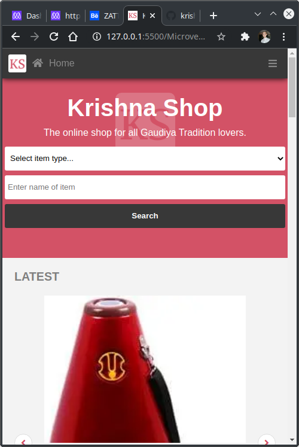
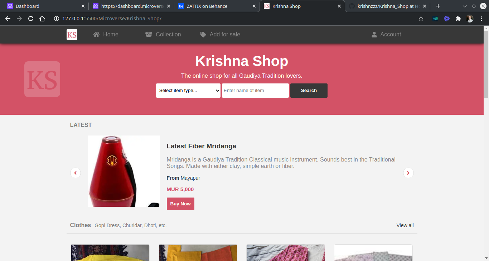

# Krishna Shop

> Capstone Project at Microverse to get understanding of how professional projects will be like.

## Screenshot

### Mobile:

### Desktop:

## Description

This project is about an online shop for Gaudiya Tradition. Gaudiya Tradition is 1 of various Indian Traditions originating from West Bengal and Vrindavana. There various traditional items like clothes and daily accessories available on the website.

This page is inspired from [Zattix Page Design](https://www.behance.net/gallery/24796463/ZATTIX) by [Muhammed Awad](https://www.behance.net/M_Awad).

It is a static version. All contents (texts, images, icons and fonts) have been retreived from various Gaudiya Origin websites.

## Built With

- HTML 
- CSS
- Linter
- VScode

## Demo Link

[Live Demo Link](https://krishnzzz.github.io/Krishna_Shop/)

## Contributing

Contributions, issues and feature requests are welcome! Start by:

  - Forking the project
  - Cloning the project to your local machine
  - cd into the project directory
  - Run git checkout -b your-branch-name
  - Make your contributions
  - Push your branch up to your forked repository
  - Open a Pull Request with a detailed description to the development branch of the original project for a review

## Author

👤 Suyash Fowdar
Github: [@Krishnzzz](https://github.com/krishnzzz)

## Show your Support
Give a ⭐ if you like this project!
